# awesome-uopeople-cs
🌐 A community-driven collection of computing and computer science resources for University of the People students. From tutorials and tools to articles, career tips, and general tech knowledge — all in one place to support your CS journey and beyond.

# Graph
Gray is elective

Black is required

```mermaid
graph TD
    %% === Course Nodes ===
    A[UNIV 1001: Online Education Strategies]
    B[CS 1101: Programming Fundamentals]
    C[CS 1102: Programming 1]
    D[CS 1103: Programming 2]
    E[CS 3305: Data Structures]
    F[CS 2203: Data Science]
    G[CS 3303: Machine Learning]
    H[MATH 1201: College Algebra]
    I[CS 1121: Discrete Mathematics]
    J[CS 2205: Web Programming 1]
    K[CS 2401: Databases 1]
    L[CS 3307: Databases 2]
    M[CS 2301: Operating Systems]
    N[CS 4406: Software Engineering]
    O[CS 4999: Capstone Project]

    %% === Relationships ===
    A --> B
    B --> C
    C --> D
    D --> E
    B --> F
    F --> G
    A --> H
    H --> I
    I --> J
    E --> K
    K --> L
    J --> M
    E --> M
    M --> N
    E --> N
    N --> O

    %% === Styling ===
    classDef required fill:#161616,stroke:#2a65a6,stroke-width:1px;
    classDef elective fill:#404040,stroke:#666,stroke-width:1px;

    class A,B,C,D,E,H,I,J,K,L,M,N,O required;
    class F,G elective;
```

