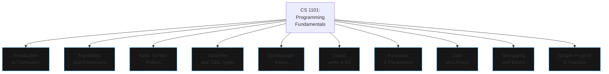

```mermaid
graph TD
    A[CS 1101:<br/>Programming<br/>Fundamentals]

    A --> B[Introduction<br/>to Computers]
    A --> C[Algorithms<br/>and Flowcharts]
    A --> D[Basic Syntax:<br/>Python]
    A --> E[Variables<br/>and Data Types]
    A --> F[Conditionals:<br/>if/else]
    A --> G[Loops:<br/>while & for]
    A --> H[Functions<br/>& Parameters]
    A --> I[Lists<br/>and Arrays]
    A --> J[Debugging<br/>and Errors]
    A --> K[Simple Projects<br/>& Practice]

    %% Styling (optional)
    classDef topic fill:#161616,stroke:#007acc,stroke-width:1px;
    class B,C,D,E,F,G,H,I,J,K topic;
```
